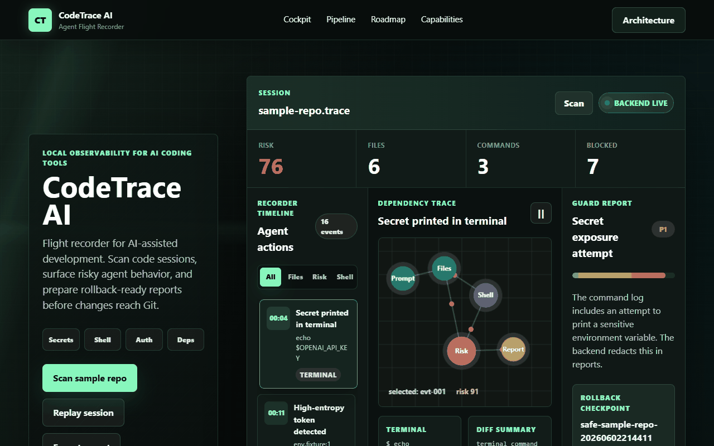
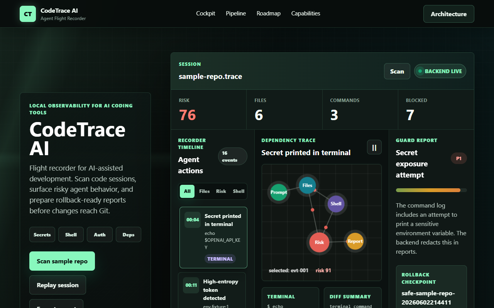
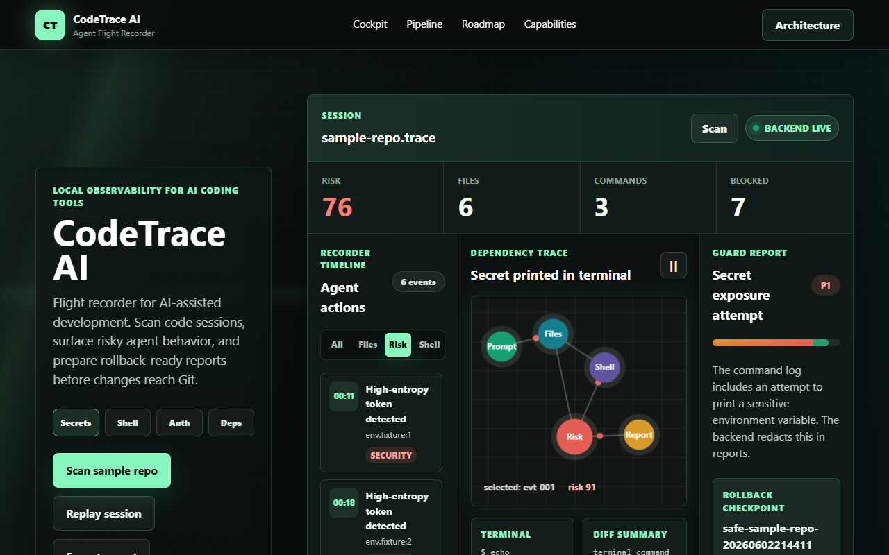
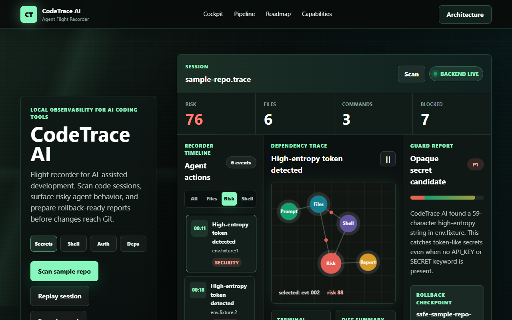
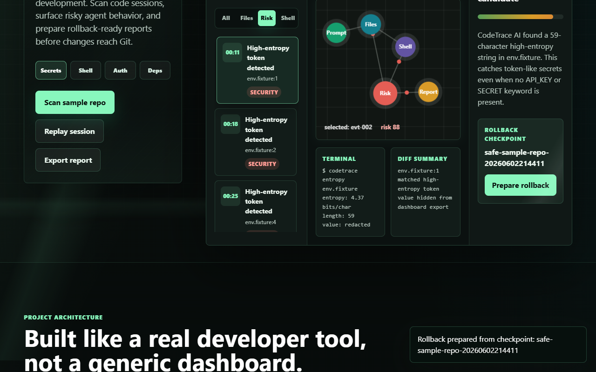

# CodeTrace AI



[](https://github.com/kanakanjali/CodeTraceAI/actions/workflows/ci.yml)


**CodeTrace AI** is a flight recorder for AI-assisted development. It records file edits, shell commands, dependency installs, sensitive file access, and Git checkpoints from a coding session — then produces a risk report that helps you review or roll back AI-made changes.

> **Demo mode:** Open `index.html` directly in a browser.
> **Full-stack mode:** Run `npm start` and open `http://localhost:4173`.

---

## Why This Exists

AI coding tools can change files, install packages, and run commands fast. CodeTrace AI makes those sessions auditable by recording risk events and linking them to rollback checkpoints — so you can always answer "what exactly did the AI touch?"

---

## Features

- 🕵️ **Session timeline** — interactive trace of every AI coding event
- ⚠️ **Risk scoring** — file, terminal, package, and security events each get a score
- 🔐 **Secret detection** — regex and Shannon-entropy scanning for leaked tokens
- 📊 **Animated trace graph** — shows how prompts, files, commands, risks, and reports connect
- 🔁 **Rollback checkpoint preview** — linked to every risky session
- 📤 **Report export** — one-click session export
- 🖥️ **CLI scanner** — scan any local folder from the terminal
- 🪝 **Git hook integration** — auto-snapshot on every commit
- 💾 **SQLite-backed history** — persistent session storage with `better-sqlite3`
- 📋 **Structured file diffs** — line counts and regex-based function detection
- 🧪 **Sample risky repository** — fake secrets, auth code, package drift, DB migrations

---

## Screenshots

| Dashboard | Security Filter | Entropy Event | Rollback |
|-----------|-----------------|---------------|---------|
|  |  |  |  |

---

## Architecture

```text
CLI recorder / browser dashboard
        │
        ▼
Scanner + optional Git hook snapshots
        │
        ▼
SQLite session store
  - sessions
  - redacted file snapshots
  - structured diff summaries
        │
        ▼
Risk engine
  - secret detection
  - entropy scoring for opaque tokens
  - sensitive file rules
  - risky command rules
  - dependency diff rules
  - line-level diff summaries
        │
        ▼
Vanilla dashboard + report export
```

---

## Prerequisites

- [Node.js](https://nodejs.org/) **v18 or higher** (v20 LTS recommended)
- npm (comes with Node.js)
- Git (for the Git hook feature)

---

## Installation

```bash
# 1. Clone the repository
git clone https://github.com/YOUR_USERNAME/CodeTraceAI.git
cd CodeTraceAI

# 2. Install dependencies
npm install

# 3. Start the server
npm start
```

Then open **http://localhost:4173** in your browser.

Click **Scan sample repo** to run the backend scanner and save a real session in `data/codetrace.sqlite`.

---

## Usage

### Run the full-stack server

```bash
npm start
```

### Scan a project from the CLI

```bash
# Scan the built-in sample repo
npm run scan

# Scan any local project folder
node cli.js scan ../your-project
```

### Install the automatic Git snapshot hook

```bash
node cli.js install-hook ../your-project
```

This installs a `post-commit` hook that quietly runs a CodeTrace scan after every commit. It preserves any existing hook content, compares against the last SQLite snapshot, stores redacted before/after file snapshots, and records structured diff summaries.

### Run tests

```bash
npm test
```

---

## Folder Structure

```
CodeTraceAI/
├── index.html              # Frontend dashboard
├── styles.css              # Dashboard styles
├── script.js               # Frontend JavaScript
├── server.js               # Node.js HTTP API
├── cli.js                  # CLI entry point
├── tsconfig.json           # TypeScript config
├── backend/
│   ├── scanner.ts          # File/secret/command scanner
│   └── storage.ts          # SQLite session store
├── data/
│   ├── sample-session.json # Demo session data
│   └── codetrace.sqlite    # Generated at runtime (gitignored)
├── sample-repo/            # Example risky repository for scanning
│   ├── env.fixture
│   ├── codetrace.commands.log
│   ├── package.json
│   ├── src/middleware/auth.ts
│   ├── tests/auth-refresh.test.ts
│   └── db/migrations/
├── assets/                 # Demo GIF and screenshot images
├── tests/                  # Test files
└── .github/workflows/      # GitHub Actions CI
```

---

## Tech Stack

| Layer | Technology |
|-------|------------|
| Frontend | HTML, CSS, Vanilla JavaScript |
| Backend | Node.js HTTP API |
| Storage | SQLite via `better-sqlite3` |
| Language | TypeScript (compiled via `tsx`) |
| Scanner | Regex + Shannon entropy secret detection |
| CI | GitHub Actions (Node 18, 20, 22) |

---

## Roadmap

- [ ] VS Code sidebar extension
- [ ] Hosted sample dashboard
- [ ] Support for multiple concurrent sessions
- [ ] Webhook integration for team alerts

---

## Contributing

Pull requests are welcome! For major changes, please open an issue first to discuss what you'd like to change.

1. Fork the repo
2. Create your feature branch: `git checkout -b feature/my-feature`
3. Commit your changes: `git commit -m 'Add my feature'`
4. Push to the branch: `git push origin feature/my-feature`
5. Open a Pull Request

---

## License

[MIT](LICENSE)
